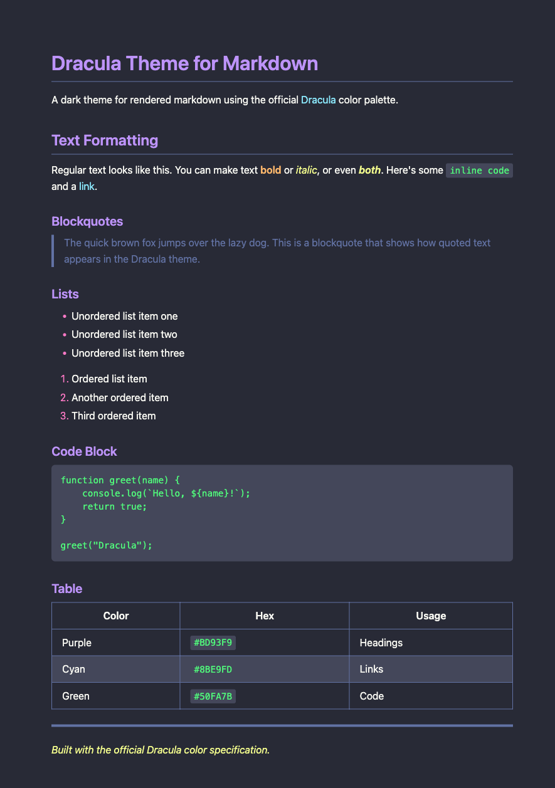

# Dracula for Markdown CSS

> A dark theme for rendered markdown content on the web.

## About

A standalone CSS stylesheet for styling rendered markdown with the Dracula color scheme. Use it anywhere you display markdown: static sites, documentation, blogs, or custom markdown renderers.

## Install

All instructions can be found at [draculatheme.com/markdown-css](https://draculatheme.com/markdown-css).

## Team

This theme is maintained by the following person(s) and a bunch of [awesome contributors](https://github.com/dracula/markdown-css/graphs/contributors).

|  |
| --- |
| [James Fishwick](https://github.com/jamesfishwick) |

## Community

- [Twitter](https://twitter.com/draculatheme) - Best for getting updates about themes and new stuff.
- [GitHub](https://github.com/dracula/dracula-theme/discussions) - Best for asking questions and discussing issues.
- [Discord](https://draculatheme.com/discord-invite) - Best for hanging out with the community.

## License

[MIT License](./LICENSE)
